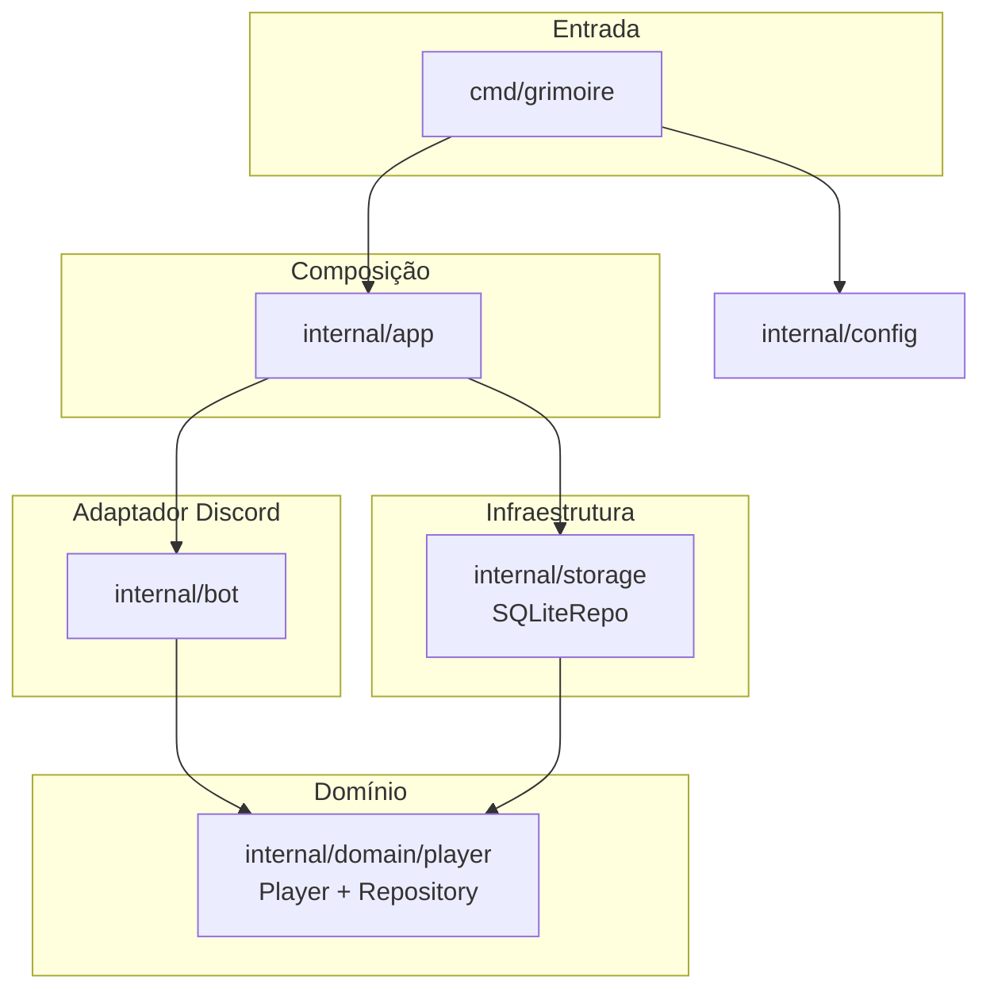

# Arquitetura

O **Grimoire** é um bot de Discord que exibe um painel compartilhado de estatísticas de mesa (críticos, dano, cura, quedas, mortes e anotações por jogador). Este documento descreve como os pacotes Go se organizam, como os dados fluem até o SQLite e onde entram validação e observabilidade.

## Visão em camadas

| Camada | Pacote | Responsabilidade |
|--------|--------|------------------|
| Entrada | `cmd/grimoire` | Carrega configuração, trata sinal de encerramento (`SIGINT` / `SIGTERM`) e chama `app.Run`. |
| Composição | `internal/app` | Abre a sessão Discord, abre o SQLite, envolve o repositório com logging, carrega jogadores, instancia `GrimoireBot`, registra o comando slash e os handlers de interação; bloqueia até o contexto ser cancelado. |
| Adaptador Discord | `internal/bot` | Comando `/grimoire`, componentes de mensagem (select, botões, modals), renderização da tabela ANSI. Depende apenas da interface `player.Repository`, não do SQLite. |
| Domínio | `internal/domain/player` | Agregado `Player`, regras de incremento e atualização, validação e sanitização (`validate.go`), porta `Repository`. Sem imports de Discord. |
| Infraestrutura | `internal/storage` | `SQLiteRepo`: migração mínima (CREATE TABLE), upsert e carga por lista de nomes. |
| Configuração | `internal/config` | `DISCORD_TOKEN`, `GRIMOIRE_DB_PATH`, `GRIMOIRE_PLAYERS`; busca `.env` subindo diretórios; validação de nomes de jogadores na carga. |

## Domínio e portas (DDD enxuto)

- **Agregado:** `Player` concentra nome, contadores, totais de dano/cura e texto custom. Operações como `AddNat20`, `UpdateStats`, `SetCustom` aplicam regras e limites no próprio pacote.
- **Porta:** `Repository` define `SavePlayer` e `LoadPlayers` sem revelar SQL ou Discord.
- **Adaptadores:** `internal/bot` (UI) e `internal/storage` (SQLite) implementam ou consomem essa porta; eles **não** dependem um do outro.

Isso mantém o núcleo testável com `go test` sem subir gateway Discord ou disco, exceto nos testes de integração do SQLite.

## Inversão de dependências e decorator

Na subida, o `app` **não** injeta `SQLiteRepo` direto no bot. A cadeia é:

```text
SQLiteRepo  →  LoggingPlayerRepository{ Inner: sqliteRepo }  →  GrimoireBot.Repo
```

`LoggingPlayerRepository` implementa o mesmo `player.Repository`: repassa chamadas ao repositório interno e registra duração e erro com `slog`. O bot só conhece a interface; composição concreta e política de log ficam no `app`.

## Diagrama de dependências entre pacotes



- `app` importa `bot` e `storage` e liga tudo.
- `bot` e `storage` importam apenas `domain/player`; não há dependência entre `bot` e `storage`.

## Fluxo de interação (usuário → persistência)

1. **`/grimoire`** — Resposta com mensagem contendo tabela + linhas de componentes (select, botões, abertura de modais).
2. **Componentes** (select / botões) — Mutex global no bot; mapa **`activeByMsg`** associa o **ID da mensagem do painel** ao **jogador selecionado**. Sem jogador focado, ações relevantes respondem com mensagem **ephemeral**. Alterações que mudam estado chamam `Repo.SavePlayer` e depois `InteractionResponseUpdateMessage` para atualizar a mesma mensagem. Ações adicionais incluem **limpar** os dados do jogador focado (`ClearAll` no domínio) e abrir o modal **editar jogador** (estado completo em até cinco campos, por limite da API do Discord).
3. **Modal** — `CustomID` usa prefixo (`modal_data:`, `modal_custom:` ou `modal_edit_full:`) + ID da mensagem para recuperar o painel; o handler valida o formato do ID (somente dígitos, comprimento compatível com snowflake do Discord). Validação dos campos numéricos e do texto custom ocorre **antes** de aplicar mudanças e de empilhar undo; em falha de persistência, o fluxo pode reverter o último passo com a pilha de desfazer.

O `app` registra cada tipo de interação (comando / componente / modal) em `logDiscordInteraction`, usando apenas identificadores públicos do Discord — sem token ou segredo nos logs.

## Validação, sanitização e banco

- **SQL:** todas as escritas e leituras usam **parâmetros posicionais** (`?`), sem concatenar entrada do usuário na query — base para evitar injeção de SQL.
- **Domínio:** funções como `ValidateName`, `ParseModalStatInt`, `SanitizeCustom` e `ValidateForPersistence` concentram limites (tamanhos, faixas numéricas, ausência de caracteres de controle) e UTF-8 seguro (`ToValidUTF8` onde aplicável).
- **Carga do SQLite:** `LoadStats` normaliza valores fora da faixa (clamp) e sanitiza o texto custom, mitigando linhas antigas ou arquivo alterado manualmente.
- **Escrita:** `SQLiteRepo.SavePlayer` chama `ValidateForPersistence` antes do `INSERT`/`UPDATE`; falhas de validação não chegam ao banco.

Tratamento de erro no handler de modais evita expor detalhes internos ao usuário final; mensagens genéricas ou de validação são preferíveis a textos de driver ou stack.

## Estado em memória e concorrência

- Um **mutex** protege `PlayersStats`, `activeByMsg` e `undoByMsg` durante handlers.
- **Undo** é por **ID de mensagem** do painel, com limite de entradas por mensagem, para não crescer sem teto.

## Esquema SQLite (resumo)

Tabela **`players`**: chave primária **`name`** (TEXT), colunas inteiras para `nat20`, `nat1`, `dano_total`, `dano_max`, `cura_total`, `cura_max`, `quedas`, `mortes`, e **`custom`** (TEXT). A criação é feita no `Open` do repositório; não há migrações versionadas separadas no repositório atual.

## Dependências principais

| Módulo | Função |
|--------|--------|
| `github.com/bwmarrin/discordgo` | API e gateway Discord |
| `modernc.org/sqlite` | Driver SQLite em Go puro (sem CGO) |
| `github.com/joho/godotenv` | Carga opcional de `.env` |

## Evolução sugerida (alinhado ao README)

Camada de **casos de uso** (`internal/application`), **value objects** para nome/estatísticas, **migrações** de schema explícitas, **CI** com `go test` e análise estática, e métricas mais ricas são próximos passos naturais sem quebrar a separação atual entre domínio, adaptador Discord e infraestrutura. Ver também o [README principal](../README.md#como-evoluir-o-código-escala-e-qualidade).
