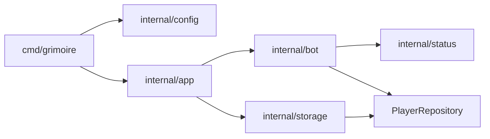

# Arquitetura

## Visão geral

O binário em `cmd/grimoire` carrega configuração, abre a sessão **Discord** (`discordgo`) e delega a orquestração para `internal/app`. O domínio do jogo (estado de cada jogador) vive em `internal/status`. A camada de bot (comandos, componentes, modais e renderização da mensagem) está em `internal/bot`. A persistência é **SQLite** em `internal/storage`, com um adaptador que só adiciona logs em `internal/bot` (`LoggingPlayerRepository`).

## Pacotes

| Pacote | Papel |
|--------|--------|
| `cmd/grimoire` | Ponto de entrada: lê `DISCORD_TOKEN`, contexto com sinais de encerramento, chama `app.Run`. |
| `internal/config` | Carrega `.env` subindo pelos diretórios pais, expõe token, caminho do DB e lista de nomes (`GRIMOIRE_PLAYERS`, separado por vírgulas). |
| `internal/app` | Cria sessão Discord, repositório SQLite decorado com logging, instancia `GrimoireBot`, registra handlers de interação e o comando slash `grimoire`, abre gateway e espera `ctx.Done()`. |
| `internal/bot` | `GrimoireBot`: tabela ANSI, menus e botões, mutex por mensagem (`activeByMsg` associa ID da mensagem ao jogador selecionado), `HandleComponents` / `HandleModals`, interface `PlayerRepository`. |
| `internal/status` | Struct `Player` e operações de leitura/escrita de campos (sem Discord). |
| `internal/storage` | `SQLiteRepo`: migração implícita (`CREATE TABLE IF NOT EXISTS`), `SavePlayer` com `UPSERT`, `LoadPlayers` por lista de nomes. |

## Fluxo de uma interação

1. **Slash** `grimoire`: responde com mensagem contendo conteúdo da tabela e `CreateComponents()`.
2. **Componente** (select/botão): trava `Mu`, resolve `msgID` da mensagem do painel; select atualiza `activeByMsg[msgID]`; botões incrementam stats ou abrem modal; respostas usam `UpdateMessage` ou ephemeral quando falta seleção.
3. **Modal**: `CustomID` leva prefixo + `msgID` para recuperar o jogador em foco; aplica valores ao `Player` e persiste.

`internal/app` também registra cada interação em log estruturado (`slog`) em `logDiscordInteraction`, sem expor conteúdo sensível além de IDs já públicos no Discord.

## Modelo de dados (SQLite)

Tabela `players`: chave primária `name`, inteiros para nat20, nat1, dano/cura total e máximo, quedas, mortes, e `custom` (texto).

## Dependências principais

- `github.com/bwmarrin/discordgo` — API Discord e gateway.
- `modernc.org/sqlite` — driver SQLite puro Go (sem CGO).
- `github.com/joho/godotenv` — carregamento opcional de `.env`.

## Extensões naturais (não implementadas aqui)

Novos comandos ou botões costumam passar por: método em `GrimoireBot`, eventual campo em `status.Player`, coluna em `storage` e migração da query `CREATE TABLE` / `SavePlayer` / `LoadPlayers`.
